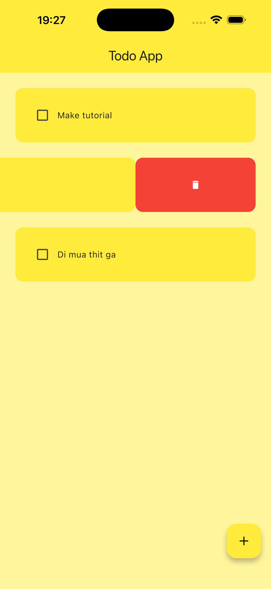

# Todo App

A simple and intuitive Todo application built with Flutter and Hive for local data persistence.

## 📱 About

This is a learning project that demonstrates fundamental Flutter concepts including:

- State management with StatefulWidget
- Local database storage using Hive
- Custom widgets and UI components
- Material Design 3 theming
- CRUD operations (Create, Read, Update, Delete)

## ✨ Features

- ✅ Add new tasks
- ✅ Mark tasks as complete/incomplete
- ✅ Delete tasks
- ✅ Persistent storage (data saved locally)
- ✅ Clean and modern UI with yellow theme
- ✅ Material Design 3 support

## 🛠️ Technologies Used

- **Flutter** - UI framework
- **Hive** - Lightweight and fast NoSQL database for local storage
- **Material Design 3** - Modern UI design system

## 📸 Screenshots

<div align="center">

  <!-- Container cho ảnh 1 -->
  <div style="display: inline-block; width: 45%; height: 300px; border-radius: 16px; overflow: hidden; box-shadow: 0 4px 8px rgba(0,0,0,0.2);">
    
  </div>

&nbsp;&nbsp;&nbsp;&nbsp;

  <!-- Container cho ảnh 2 -->
  <div style="display: inline-block; width: 45%; height: 300px; border-radius: 16px; overflow: hidden; box-shadow: 0 4px 8px rgba(0,0,0,0.2);">
    
  </div>

</div>

## 🚀 Getting Started

### Prerequisites

- Flutter SDK (latest version)
- Dart SDK
- Android Studio / VS Code
- iOS Simulator / Android Emulator

### Installation

1. Clone the repository

```bash
git clone <your-repo-url>
cd todo_app
```

2. Install dependencies

```bash
flutter pub get
```

3. Run the app

```bash
flutter run
```

## 📦 Dependencies

```yaml
dependencies:
  flutter:
    sdk: flutter
  hive: ^2.2.3
  hive_flutter: ^1.1.0
```

## 📁 Project Structure

```
lib/
├── main.dart              # App entry point
├── pages/
│   └── home_page.dart     # Main todo list screen
├── util/
│   ├── dialog_box.dart    # Add task dialog
│   ├── my_button.dart     # Custom button widget
│   └── todo_tile.dart     # Todo item widget
└── data/
    └── database.dart      # Hive database operations
```

## 🎨 Customization

The app uses a yellow color scheme defined in `main.dart`. You can customize the theme by modifying:

```dart
theme: ThemeData(
  useMaterial3: true,
  colorSchemeSeed: Colors.yellow, // Change this to your preferred color
  appBarTheme: AppBarTheme(backgroundColor: Colors.yellow),
  floatingActionButtonTheme: FloatingActionButtonThemeData(
    backgroundColor: Colors.yellow,
  ),
)
```

## 📚 What I Learned

- Setting up Hive for local data persistence
- Creating reusable custom widgets
- Managing state with setState()
- Working with ListView.builder for dynamic lists
- Implementing dialogs and user interactions
- Applying Material Design 3 theming
- CRUD operations with local database

## 🔮 Future Improvements

- [ ] Add task categories
- [ ] Implement task priority levels
- [ ] Add due dates and reminders
- [ ] Search and filter functionality
- [ ] Dark mode support
- [ ] Task editing functionality
- [ ] Data export/import

## 📄 License

This project is open source and available for learning purposes.

## 👤 Author

Created as a learning project to explore Flutter development and local data storage.

---

**Note**: This is a learning project and may not include all production-ready features or best practices.
